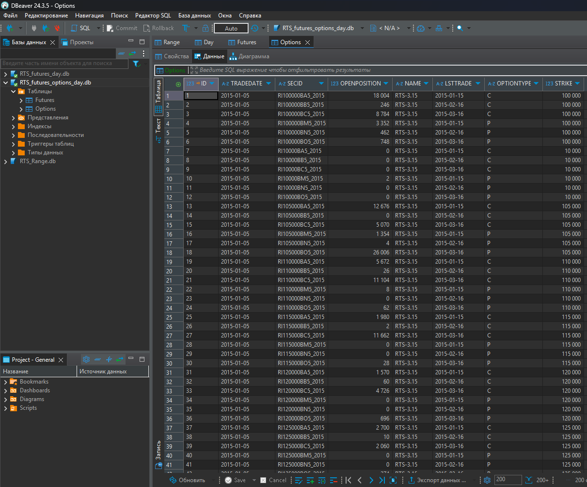

# Скрипты для загрузки данных о котировках фьючерсов и опционов RTS с MOEX через MOEX ISS API и запись полученных данных в базу данных SQLite 3.  

## Использование

* `sqlighter` - при запуске скрипт создает базу данных. 
При вызове из других скриптов получает доступ к БД.
* `update` - обновляет (добавляет) данные в БД.

